---
check:
  files_exist:
    - .github/workflows/ci.yml
---

# CI/CD: GitHub Actions + Dokploy + Neon

Este skill define el flujo estándar para integración y despliegue continuo en proyectos web.

## Flujo de Entornos

```mermaid
graph LR
    F[Feature Branch] -->|PR| D[Dev Branch]
    D -->|Auto Deploy| E1[Entorno Dev]
    D -->|PR + QA| M[Main Branch]
    M -->|Auto Deploy| E2[Producción]
```

1. **Feature:** Desarrollo local.
2. **Dev:** Entorno de integración. Aquí se hacen pruebas manuales.
3. **Main:** Producción estable.

## GitHub Actions Template

Crea el archivo `.github/workflows/ci.yml`:

\`\`\`yaml
name: CI/CD

on:
  push:
    branches: [dev, main]
  pull_request:
    branches: [dev, main]

jobs:
  validate:
    name: 🛡️ Validate
    runs-on: ubuntu-latest
    steps:
      - uses: actions/checkout@v4
      
      - name: Setup Node
        uses: actions/setup-node@v4
        with:
          node-version: '20'
          cache: 'npm'
          
      - name: Install Dependencies
        run: npm ci
        
      - name: Install Kolyn
        run: curl -sfL https://raw.githubusercontent.com/isai-arellano/kolyn-cli/main/install.sh | sh
        
      - name: Sync Skills
        run: kolyn sync
        
      - name: Kolyn Audit
        run: kolyn check
        
      - name: Build
        run: npm run build

  deploy-dev:
    name: 🚀 Deploy Dev
    needs: validate
    if: github.event_name == 'push' && github.ref == 'refs/heads/dev'
    runs-on: ubuntu-latest
    steps:
      - name: Deploy to Dokploy (Dev)
        run: |
          curl -X POST "${{ secrets.DOKPLOY_URL }}/api/deploy" \
            -H "Authorization: Bearer ${{ secrets.DOKPLOY_TOKEN }}" \
            -d '{"app": "${{ secrets.APP_NAME_DEV }}"}'

  deploy-prod:
    name: 🚀 Deploy Prod
    needs: validate
    if: github.event_name == 'push' && github.ref == 'refs/heads/main'
    runs-on: ubuntu-latest
    steps:
      - name: Deploy to Dokploy (Prod)
        run: |
          curl -X POST "${{ secrets.DOKPLOY_URL }}/api/deploy" \
            -H "Authorization: Bearer ${{ secrets.DOKPLOY_TOKEN }}" \
            -d '{"app": "${{ secrets.APP_NAME_PROD }}"}'
\`\`\`

## Configuración de Secretos (GitHub Repo)

Agrega estos secretos en `Settings > Secrets and variables > Actions`:

- `DOKPLOY_URL`: URL de tu instancia Dokploy (ej. `https://dokploy.midominio.com`).
- `DOKPLOY_TOKEN`: Token de API de Dokploy.
- `APP_NAME_DEV`: Nombre de la aplicación en Dokploy para Dev.
- `APP_NAME_PROD`: Nombre de la aplicación en Dokploy para Producción.

## Configuración Neon (Database Branching)

1. En el dashboard de Neon, ve a **Branches**.
2. Crea un branch llamado `dev` derivado de `main`.
3. En Dokploy (Entorno Dev), usa la connection string del branch `dev`.
4. En Dokploy (Entorno Prod), usa la connection string del branch `main`.
